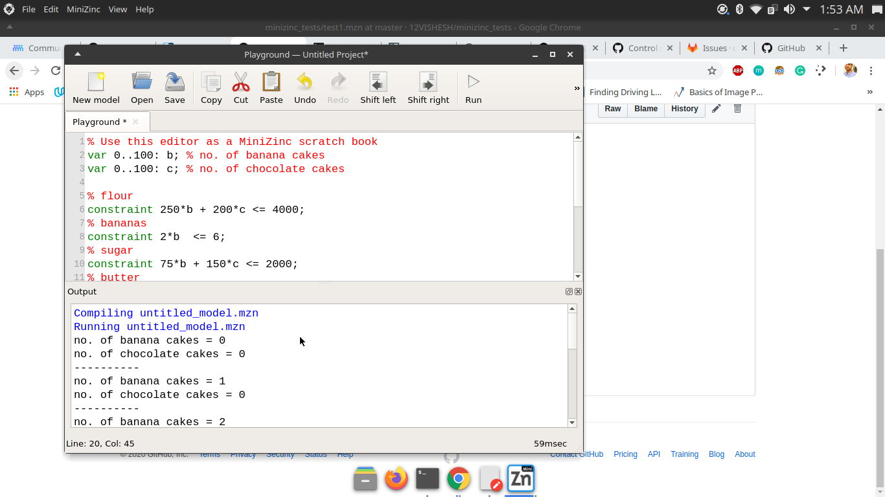

# Minizinc Tests

## A repo for example MiniZinc models.
### Task Name:
#### (a) Install MiniZinc on your computer and run some of the examples, for example from the Handbook or the examples pages;

Minizinc  is used for to model constraint satisfaction and optimization problems in a high-level, solver-independent way.

Example-

#### (b) Study a bit of the MiniZinc modeling language and formulate and solve an example of your own. How will the R input and output look like?

I solved  the exmaple which is  given in the hanbook and also  solved the similar type of problem.

### Medium
#### (a) Install the Python package and run some of the examples; describe how this package interfaces MiniZinc with Python and returns its result;

Open the [Python test .](https://github.com/12VISHESH/minizinc_tests/blob/master/mini_tests/python%20test.png)
